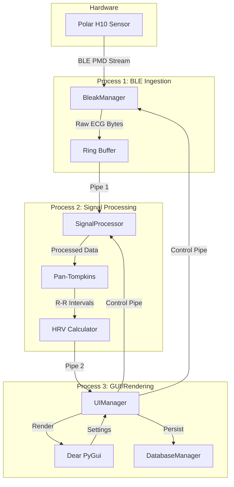
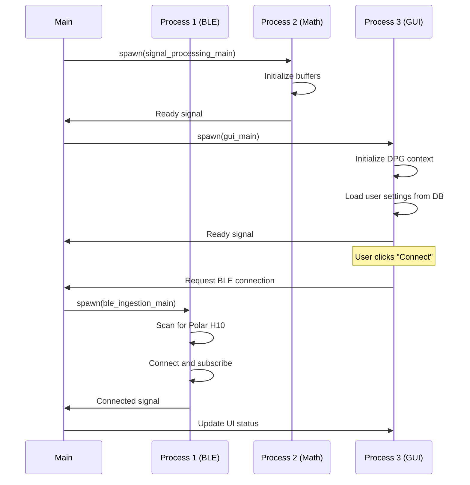
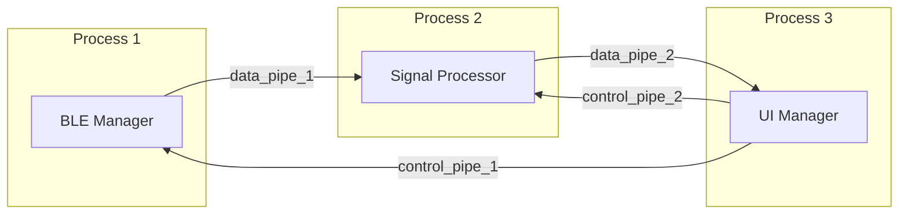
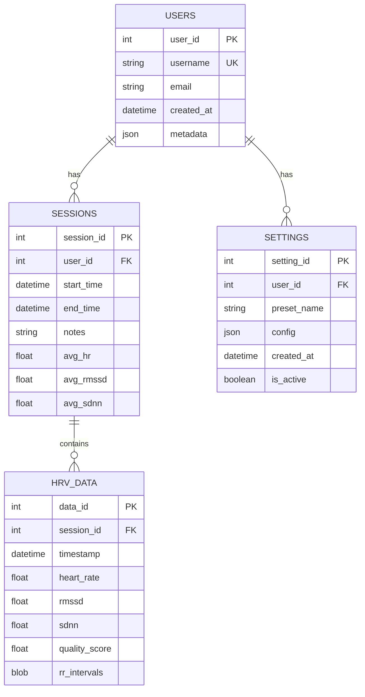
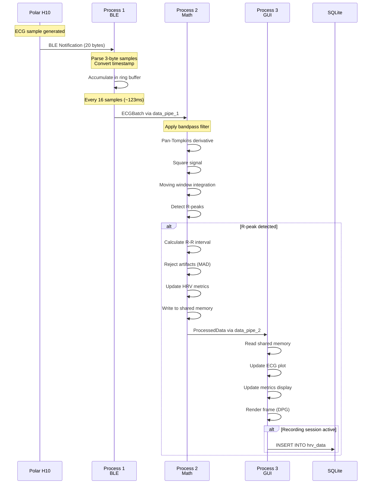
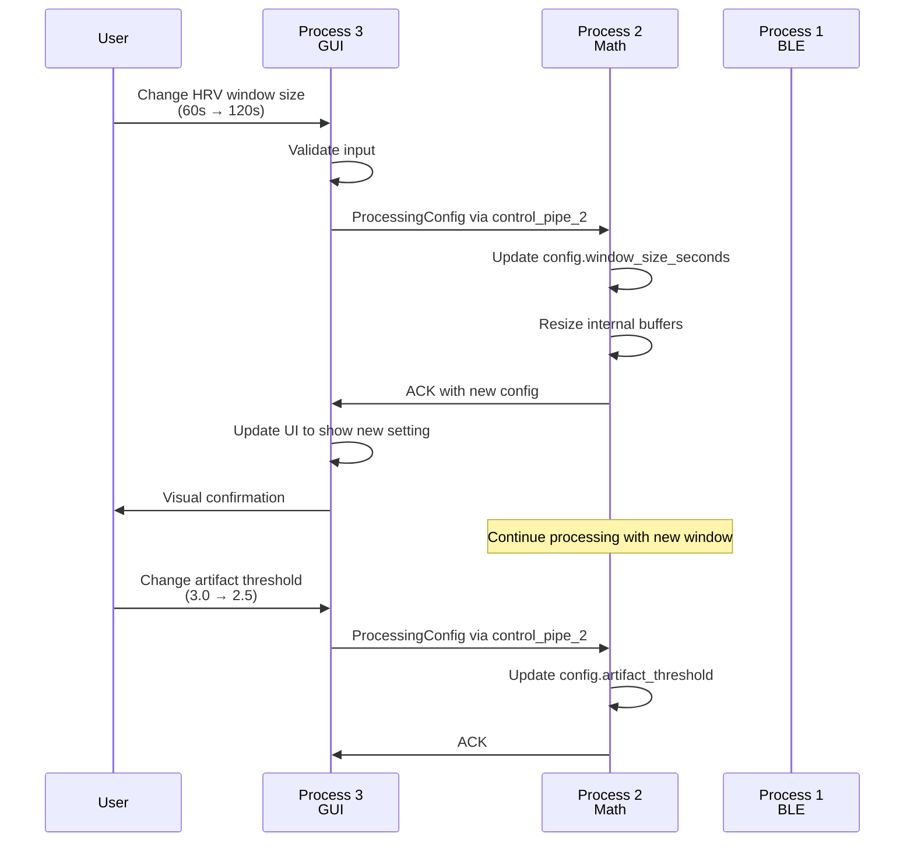

# Polar Flow-Sync Real-Time HRV Dashboard - System Architecture Design

**Document Version:** 1.0  
**Last Updated:** 2026-02-14T10:00:46Z  
**Status:** Draft for Review

---

## Table of Contents

1. [Executive Summary](#executive-summary)
2. [System Overview](#system-overview)
3. [Process Topology](#process-topology)
4. [Inter-Process Communication](#inter-process-communication)
5. [Class Structure](#class-structure)
6. [Database Schema](#database-schema)
7. [Data Flow Pipeline](#data-flow-pipeline)
8. [Settings Control Loop](#settings-control-loop)
9. [Performance Considerations](#performance-considerations)
10. [Error Handling Strategy](#error-handling-strategy)
11. [Implementation Roadmap](#implementation-roadmap)

---

## 1. Executive Summary

This document defines the architecture for a Python-based, ultra-low-latency desktop application that interfaces with the Polar H10 Heart Rate Sensor via BLE. The system is designed to achieve <150ms end-to-end latency while processing 130Hz ECG data streams and calculating real-time HRV metrics.

**Key Design Principles:**
- **Separation of Concerns:** Three independent processes for BLE, processing, and rendering
- **Lock-Free Communication:** Unidirectional pipes to minimize contention
- **Zero-Copy Where Possible:** NumPy arrays via shared memory for large data transfers
- **Fail-Fast:** Each process can crash independently without taking down the entire system

---

## 2. System Overview

### 2.1 High-Level Architecture



### 2.2 Technology Stack

| Component | Technology | Justification |
|-----------|-----------|---------------|
| BLE Interface | Bleak + Asyncio | Cross-platform, async-native BLE library |
| Signal Processing | NumPy + Numba | JIT compilation for near-C performance |
| GUI Framework | Dear PyGui | Immediate-mode GUI with native rendering |
| Database | SQLite3 | Embedded, zero-config, ACID-compliant |
| IPC | multiprocessing.Pipe | Low-latency, bidirectional communication |
| Serialization | struct + pickle | Minimal overhead for small messages |

---

## 3. Process Topology

### 3.1 Process Responsibilities

#### **Process 1: BLE Ingestion Process**
- **Purpose:** Acquire raw ECG data from Polar H10
- **Lifecycle:** Starts on device connection, runs until disconnection
- **CPU Affinity:** Core 0 (if available)
- **Priority:** High (nice -10)

**Responsibilities:**
1. Maintain BLE connection with Polar H10
2. Subscribe to PMD characteristic
3. Parse incoming BLE notifications
4. Convert Polar Epoch → Unix Epoch timestamps
5. Buffer data in ring buffer (1-second capacity)
6. Send batches to Process 2 via Pipe

#### **Process 2: Signal Processing Process**
- **Purpose:** Transform raw ECG into R-R intervals and HRV metrics
- **Lifecycle:** Persistent, survives device disconnections
- **CPU Affinity:** Core 1 (if available)
- **Priority:** High (nice -10)

**Responsibilities:**
1. Receive raw ECG batches from Process 1
2. Apply Pan-Tompkins algorithm for QRS detection
3. Calculate R-R intervals with artifact rejection
4. Compute rolling HRV metrics (RMSSD, SDNN)
5. Send processed data to Process 3 via Pipe
6. Respond to configuration changes from Process 3

#### **Process 3: GUI/Rendering Process**
- **Purpose:** Visualize data and manage user interactions
- **Lifecycle:** Main process, parent of other processes
- **CPU Affinity:** Core 2-3 (if available)
- **Priority:** Normal

**Responsibilities:**
1. Render Dear PyGui interface at 60 FPS
2. Display real-time strip chart (130Hz data)
3. Show HRV metrics and statistics
4. Handle user input (settings, session management)
5. Persist data to SQLite database
6. Send control messages to other processes

### 3.2 Process Startup Sequence



---

## 4. Inter-Process Communication

### 4.1 Pipe Architecture



### 4.2 Pipe Definitions

#### **data_pipe_1: BLE → Signal Processing**
- **Direction:** Unidirectional (Process 1 → Process 2)
- **Message Type:** `ECGBatch`
- **Frequency:** ~8 batches/second (130Hz ÷ 16 samples/batch)
- **Latency Target:** <5ms

```python
@dataclass
class ECGBatch:
    timestamp_unix: float          # Unix epoch (seconds)
    sample_rate: int               # Always 130 Hz
    samples: np.ndarray            # Shape: (N,), dtype: int32
    sequence_number: int           # For detecting drops
```

#### **data_pipe_2: Signal Processing → GUI**
- **Direction:** Unidirectional (Process 2 → Process 3)
- **Message Type:** `ProcessedData`
- **Frequency:** Variable (on R-peak detection)
- **Latency Target:** <10ms

```python
@dataclass
class ProcessedData:
    timestamp: float               # Unix epoch
    ecg_window: np.ndarray         # Last 2 seconds for display
    rr_intervals: List[float]      # Milliseconds
    heart_rate: float              # BPM
    hrv_rmssd: float              # Milliseconds
    hrv_sdnn: float               # Milliseconds
    quality_score: float          # 0.0-1.0 (artifact rejection)
```

#### **control_pipe_1: GUI → BLE**
- **Direction:** Bidirectional (Process 3 ↔ Process 1)
- **Message Type:** `BLECommand`
- **Frequency:** On-demand (user actions)

```python
@dataclass
class BLECommand:
    command: str                   # "connect", "disconnect", "get_battery"
    params: Dict[str, Any]         # Command-specific parameters
```

#### **control_pipe_2: GUI → Signal Processing**
- **Direction:** Bidirectional (Process 3 ↔ Process 2)
- **Message Type:** `ProcessingConfig`
- **Frequency:** On-demand (settings changes)

```python
@dataclass
class ProcessingConfig:
    window_size_seconds: int       # HRV calculation window
    artifact_threshold: float      # MAD multiplier
    filter_cutoff_low: float       # Hz
    filter_cutoff_high: float      # Hz
```

### 4.3 Shared Memory for Large Data

For the ECG strip chart (2 seconds × 130Hz = 260 samples), we use shared memory to avoid serialization overhead:

```python
from multiprocessing import shared_memory

# Process 2 creates shared memory
shm = shared_memory.SharedMemory(create=True, size=260*4)  # 4 bytes per int32
ecg_buffer = np.ndarray((260,), dtype=np.int32, buffer=shm.buf)

# Process 3 attaches to existing shared memory
shm = shared_memory.SharedMemory(name=shm_name)
ecg_buffer = np.ndarray((260,), dtype=np.int32, buffer=shm.buf)
```

**Synchronization:** Use a simple sequence number in `ProcessedData` to detect when the buffer has been updated.

---

## 5. Class Structure

### 5.1 Process 1: BLE Ingestion

#### **BleakManager**

```python
class BleakManager:
    """
    Manages BLE connection to Polar H10 and streams ECG data.
    Runs in dedicated process with asyncio event loop.
    """
    
    # Class Constants
    POLAR_H10_NAME_PREFIX = "Polar H10"
    PMD_SERVICE_UUID = "fb005c80-02e7-f387-1cad-8acd2d8df0c8"
    PMD_CONTROL_UUID = "fb005c81-02e7-f387-1cad-8acd2d8df0c8"
    PMD_DATA_UUID = "fb005c82-02e7-f387-1cad-8acd2d8df0c8"
    ECG_ENABLE_CMD = bytes([0x02, 0x00, 0x00, 0x01, 0x82, 0x00, 0x01, 0x01, 0x0E, 0x00])
    POLAR_EPOCH_OFFSET = 946684800  # 2000-01-01 00:00:00 UTC
    
    def __init__(self, data_pipe: Connection, control_pipe: Connection):
        self.data_pipe = data_pipe
        self.control_pipe = control_pipe
        self.client: Optional[BleakClient] = None
        self.ring_buffer = RingBuffer(capacity=130)  # 1 second
        self.sequence_number = 0
        self.is_streaming = False
        
    async def scan_and_connect(self, timeout: float = 10.0) -> bool:
        """Scan for Polar H10 and establish connection."""
        
    async def enable_ecg_stream(self) -> None:
        """Send enable command to PMD Control characteristic."""
        
    async def notification_handler(self, sender: int, data: bytearray) -> None:
        """
        Parse incoming ECG data packets.
        Format: [Type(1)][Timestamp(8)][FrameType(1)][Samples(3*N)]
        """
        
    def parse_ecg_samples(self, data: bytearray) -> Tuple[float, np.ndarray]:
        """Convert 3-byte signed integers to int32 array."""
        
    async def send_batch(self) -> None:
        """Send accumulated samples to Process 2."""
        
    async def handle_control_messages(self) -> None:
        """Process commands from GUI (connect/disconnect/battery)."""
        
    async def run(self) -> None:
        """Main event loop for BLE process."""
```

#### **RingBuffer**

```python
class RingBuffer:
    """
    Lock-free ring buffer for ECG samples.
    Thread-safe for single producer, single consumer.
    """
    
    def __init__(self, capacity: int):
        self.capacity = capacity
        self.buffer = np.zeros(capacity, dtype=np.int32)
        self.write_idx = 0
        self.read_idx = 0
        
    def write(self, samples: np.ndarray) -> None:
        """Append samples, overwriting oldest if full."""
        
    def read(self, n: int) -> np.ndarray:
        """Read n samples without removing from buffer."""
        
    def consume(self, n: int) -> np.ndarray:
        """Read and remove n samples from buffer."""
```

### 5.2 Process 2: Signal Processing

#### **SignalProcessor**

```python
class SignalProcessor:
    """
    Applies Pan-Tompkins algorithm and calculates HRV metrics.
    Optimized with Numba JIT compilation.
    """
    
    def __init__(self, input_pipe: Connection, output_pipe: Connection, 
                 control_pipe: Connection, shm_name: str):
        self.input_pipe = input_pipe
        self.output_pipe = output_pipe
        self.control_pipe = control_pipe
        
        # Shared memory for ECG display
        self.shm = shared_memory.SharedMemory(name=shm_name)
        self.ecg_display_buffer = np.ndarray((260,), dtype=np.int32, buffer=self.shm.buf)
        
        # Processing state
        self.sample_rate = 130  # Hz
        self.ecg_buffer = np.zeros(260, dtype=np.float64)  # 2 seconds
        self.rr_intervals = []  # Milliseconds
        self.last_r_peak_idx = 0
        
        # Pan-Tompkins filter coefficients
        self.bandpass_b, self.bandpass_a = self._design_bandpass()
        self.filter_state = None
        
        # Configuration
        self.config = ProcessingConfig(
            window_size_seconds=60,
            artifact_threshold=3.0,
            filter_cutoff_low=5.0,
            filter_cutoff_high=15.0
        )
        
    def _design_bandpass(self) -> Tuple[np.ndarray, np.ndarray]:
        """Design Butterworth bandpass filter (5-15 Hz)."""
        
    @staticmethod
    @njit(fastmath=True)
    def pan_tompkins_detect(signal: np.ndarray, threshold: float) -> np.ndarray:
        """
        Numba-optimized Pan-Tompkins QRS detection.
        Steps: Bandpass → Derivative → Square → Moving Integration
        Returns: Array of R-peak indices
        """
        
    @staticmethod
    @njit(fastmath=True)
    def calculate_hrv_metrics(rr_intervals: np.ndarray) -> Tuple[float, float]:
        """
        Calculate RMSSD and SDNN using running sum optimization.
        RMSSD: Root Mean Square of Successive Differences
        SDNN: Standard Deviation of NN intervals
        """
        
    def reject_artifacts(self, rr_intervals: List[float]) -> List[float]:
        """
        Remove physiologically impossible R-R intervals using MAD.
        Median Absolute Deviation: MAD = median(|x_i - median(x)|)
        """
        
    def process_batch(self, batch: ECGBatch) -> Optional[ProcessedData]:
        """Main processing pipeline for incoming ECG batch."""
        
    def handle_config_update(self, config: ProcessingConfig) -> None:
        """Update processing parameters without restarting."""
        
    def run(self) -> None:
        """Main loop for signal processing."""
```

### 5.3 Process 3: GUI and Database

#### **UIManager**

```python
class UIManager:
    """
    Manages Dear PyGui interface and coordinates with other processes.
    """
    
    def __init__(self, data_pipe: Connection, ble_control_pipe: Connection,
                 math_control_pipe: Connection, shm_name: str):
        self.data_pipe = data_pipe
        self.ble_control_pipe = ble_control_pipe
        self.math_control_pipe = math_control_pipe
        
        # Shared memory for ECG display
        self.shm = shared_memory.SharedMemory(name=shm_name)
        self.ecg_display_buffer = np.ndarray((260,), dtype=np.int32, buffer=self.shm.buf)
        
        # UI state
        self.current_user_id: Optional[int] = None
        self.current_session_id: Optional[int] = None
        self.is_connected = False
        self.is_recording = False
        
        # Display buffers
        self.ecg_plot_data = []
        self.hr_history = []
        self.hrv_history = []
        
        # Database
        self.db = DatabaseManager("hrv_data.db")
        
    def setup_ui(self) -> None:
        """Initialize Dear PyGui windows and widgets."""
        
    def create_main_window(self) -> None:
        """Main dashboard with ECG plot and metrics."""
        
    def create_user_management_window(self) -> None:
        """User login/registration interface."""
        
    def create_settings_window(self) -> None:
        """Configuration panel for processing parameters."""
        
    def update_ecg_plot(self) -> None:
        """Refresh strip chart with latest ECG data."""
        
    def update_metrics_display(self, data: ProcessedData) -> None:
        """Update HRV metrics and heart rate displays."""
        
    def handle_connect_button(self) -> None:
        """Send connect command to BLE process."""
        
    def handle_start_session(self) -> None:
        """Create new session in database and start recording."""
        
    def handle_stop_session(self) -> None:
        """End current session and persist data."""
        
    def handle_settings_change(self, setting: str, value: Any) -> None:
        """Send configuration update to signal processing."""
        
    def poll_data_pipe(self) -> None:
        """Non-blocking check for new data from Process 2."""
        
    def run(self) -> None:
        """Main Dear PyGui render loop."""
```

#### **DatabaseManager**

```python
class DatabaseManager:
    """
    Manages SQLite database for user data and HRV metrics.
    Thread-safe with connection pooling.
    """
    
    def __init__(self, db_path: str):
        self.db_path = db_path
        self.conn: Optional[sqlite3.Connection] = None
        self._initialize_schema()
        
    def _initialize_schema(self) -> None:
        """Create tables if they don't exist."""
        
    def create_user(self, username: str, email: str, **metadata) -> int:
        """Insert new user and return user_id."""
        
    def authenticate_user(self, username: str) -> Optional[int]:
        """Verify user exists and return user_id."""
        
    def create_session(self, user_id: int, notes: str = "") -> int:
        """Start new recording session."""
        
    def end_session(self, session_id: int) -> None:
        """Mark session as completed."""
        
    def save_hrv_data(self, session_id: int, data: ProcessedData) -> None:
        """Persist HRV metrics to database."""
        
    def get_user_settings(self, user_id: int) -> Dict[str, Any]:
        """Load user's saved configuration."""
        
    def save_user_settings(self, user_id: int, settings: Dict[str, Any]) -> None:
        """Persist user configuration."""
        
    def get_session_statistics(self, session_id: int) -> Dict[str, float]:
        """Calculate aggregate metrics for a session."""
```

---

## 6. Database Schema

### 6.1 Entity-Relationship Diagram



### 6.2 SQL Schema Definition

```sql
-- Users Table
CREATE TABLE IF NOT EXISTS users (
    user_id INTEGER PRIMARY KEY AUTOINCREMENT,
    username TEXT NOT NULL UNIQUE,
    email TEXT,
    created_at TIMESTAMP DEFAULT CURRENT_TIMESTAMP,
    metadata TEXT  -- JSON: age, weight, notes, etc.
);

CREATE INDEX idx_users_username ON users(username);

-- Sessions Table
CREATE TABLE IF NOT EXISTS sessions (
    session_id INTEGER PRIMARY KEY AUTOINCREMENT,
    user_id INTEGER NOT NULL,
    start_time TIMESTAMP DEFAULT CURRENT_TIMESTAMP,
    end_time TIMESTAMP,
    notes TEXT,
    avg_hr REAL,
    avg_rmssd REAL,
    avg_sdnn REAL,
    FOREIGN KEY (user_id) REFERENCES users(user_id) ON DELETE CASCADE
);

CREATE INDEX idx_sessions_user_id ON sessions(user_id);
CREATE INDEX idx_sessions_start_time ON sessions(start_time);

-- Settings/Presets Table
CREATE TABLE IF NOT EXISTS settings (
    setting_id INTEGER PRIMARY KEY AUTOINCREMENT,
    user_id INTEGER NOT NULL,
    preset_name TEXT NOT NULL,
    config TEXT NOT NULL,  -- JSON: ProcessingConfig serialized
    created_at TIMESTAMP DEFAULT CURRENT_TIMESTAMP,
    is_active BOOLEAN DEFAULT 0,
    FOREIGN KEY (user_id) REFERENCES users(user_id) ON DELETE CASCADE,
    UNIQUE(user_id, preset_name)
);

CREATE INDEX idx_settings_user_id ON settings(user_id);

-- HRV Data Table (Time-Series)
CREATE TABLE IF NOT EXISTS hrv_data (
    data_id INTEGER PRIMARY KEY AUTOINCREMENT,
    session_id INTEGER NOT NULL,
    timestamp TIMESTAMP NOT NULL,
    heart_rate REAL NOT NULL,
    rmssd REAL,
    sdnn REAL,
    quality_score REAL,
    rr_intervals BLOB,  -- Pickled numpy array
    FOREIGN KEY (session_id) REFERENCES sessions(session_id) ON DELETE CASCADE
);

CREATE INDEX idx_hrv_data_session_id ON hrv_data(session_id);
CREATE INDEX idx_hrv_data_timestamp ON hrv_data(timestamp);
```

### 6.3 Sample Data Queries

```sql
-- Get user's last 10 sessions
SELECT session_id, start_time, end_time, avg_hr, avg_rmssd
FROM sessions
WHERE user_id = ?
ORDER BY start_time DESC
LIMIT 10;

-- Calculate session statistics
SELECT 
    AVG(heart_rate) as avg_hr,
    AVG(rmssd) as avg_rmssd,
    AVG(sdnn) as avg_sdnn,
    MIN(heart_rate) as min_hr,
    MAX(heart_rate) as max_hr
FROM hrv_data
WHERE session_id = ?;

-- Get active preset for user
SELECT config
FROM settings
WHERE user_id = ? AND is_active = 1
LIMIT 1;
```

---

## 7. Data Flow Pipeline

### 7.1 End-to-End Data Journey

**Latency Budget Breakdown:**

| Stage | Component | Target Latency | Cumulative |
|-------|-----------|----------------|------------|
| 1 | BLE Notification → Parse | 5ms | 5ms |
| 2 | Buffer → Pipe Send | 3ms | 8ms |
| 3 | Pipe Transfer | 2ms | 10ms |
| 4 | Pan-Tompkins Processing | 50ms | 60ms |
| 5 | HRV Calculation | 20ms | 80ms |
| 6 | Pipe Transfer | 2ms | 82ms |
| 7 | GUI Update | 30ms | 112ms |
| 8 | DPG Render | 16ms (60 FPS) | 128ms |

**Total End-to-End Latency:** ~130ms (within 150ms target)

### 7.2 Detailed Flow Diagram



### 7.3 Sample Data Transformation

**Stage 1: Raw BLE Packet**
```
Hex: 02 00 00 00 00 5F 8A 3C 00 00 12 34 56 78 9A BC
     └─┘ └──────────────┘ └─┘ └──────────────────┘
     Type  Timestamp(8)   Frame  ECG Samples(3*N)
```

**Stage 2: Parsed ECG Batch**
```python
ECGBatch(
    timestamp_unix=1707905280.0,
    sample_rate=130,
    samples=array([4660, 30806, -17510], dtype=int32),
    sequence_number=42
)
```

**Stage 3: Filtered Signal**
```python
# After bandpass (5-15 Hz)
filtered = array([0.12, 0.45, 0.89, 1.23, 0.67, ...])
```

**Stage 4: Pan-Tompkins Output**
```python
# R-peak indices in signal
r_peaks = array([65, 195, 325])  # ~130 samples apart (1 Hz)
```

**Stage 5: R-R Intervals**
```python
# Time between peaks in milliseconds
rr_intervals = [1000.0, 1015.4, 992.3]  # ~60 BPM
```

**Stage 6: HRV Metrics**
```python
ProcessedData(
    timestamp=1707905280.5,
    ecg_window=array([...]),  # 260 samples
    rr_intervals=[1000.0, 1015.4, 992.3, ...],
    heart_rate=60.2,
    hrv_rmssd=42.3,  # Milliseconds
    hrv_sdnn=38.7,   # Milliseconds
    quality_score=0.95
)
```

**Stage 7: Database Record**
```sql
INSERT INTO hrv_data VALUES (
    NULL,  -- auto-increment
    123,   -- session_id
    '2026-02-14 10:01:20.5',
    60.2,  -- heart_rate
    42.3,  -- rmssd
    38.7,  -- sdnn
    0.95,  -- quality_score
    X'...' -- pickled rr_intervals
);
```

---

## 8. Settings Control Loop

### 8.1 Real-Time Configuration Updates

The system supports dynamic reconfiguration without restarting data streams. This is critical for user experience during live sessions.



### 8.2 Supported Runtime Settings

| Setting | Process | Update Latency | Requires Restart |
|---------|---------|----------------|------------------|
| HRV Window Size | Process 2 | <10ms | No |
| Artifact Threshold | Process 2 | <10ms | No |
| Filter Cutoffs | Process 2 | <50ms | No (recompute coefficients) |
| Display Refresh Rate | Process 3 | Immediate | No |
| BLE Reconnect | Process 1 | N/A | Yes (disconnect/connect) |
| Sample Rate | Process 1 | N/A | Yes (Polar H10 limitation) |

### 8.3 Configuration Persistence

```python
# When user changes setting in GUI
def handle_settings_change(self, setting: str, value: Any) -> None:
    # 1. Update in-memory config
    self.current_config[setting] = value
    
    # 2. Send to appropriate process
    if setting in ['window_size_seconds', 'artifact_threshold', 'filter_cutoff_low', 'filter_cutoff_high']:
        config = ProcessingConfig(**self.current_config)
        self.math_control_pipe.send(('UPDATE_CONFIG', config))
        
        # Wait for acknowledgment
        response = self.math_control_pipe.recv()
        if response[0] == 'ACK':
            # 3. Persist to database
            self.db.save_user_settings(self.current_user_id, self.current_config)
            # 4. Update UI
            dpg.set_value(f"{setting}_status", "✓ Applied")
```

### 8.4 Preset Management

Users can save and load configuration presets:

```python
class PresetManager:
    """Manages user configuration presets."""
    
    def save_preset(self, user_id: int, name: str, config: ProcessingConfig) -> None:
        """Save current configuration as named preset."""
        config_json = json.dumps(asdict(config))
        self.db.execute(
            "INSERT INTO settings (user_id, preset_name, config) VALUES (?, ?, ?)",
            (user_id, name, config_json)
        )
    
    def load_preset(self, user_id: int, name: str) -> ProcessingConfig:
        """Load preset and apply to system."""
        row = self.db.execute(
            "SELECT config FROM settings WHERE user_id = ? AND preset_name = ?",
            (user_id, name)
        ).fetchone()
        
        config_dict = json.loads(row[0])
        return ProcessingConfig(**config_dict)
    
    def set_active_preset(self, user_id: int, name: str) -> None:
        """Mark preset as active (auto-load on login)."""
        self.db.execute("UPDATE settings SET is_active = 0 WHERE user_id = ?", (user_id,))
        self.db.execute(
            "UPDATE settings SET is_active = 1 WHERE user_id = ? AND preset_name = ?",
            (user_id, name)
        )
```

---

## 9. Performance Considerations

### 9.1 Latency Optimization Strategies

#### **1. Zero-Copy Data Transfer**
- Use `multiprocessing.shared_memory` for ECG display buffer
- Avoid pickle serialization for large numpy arrays
- Pass memory addresses instead of copying data

#### **2. Numba JIT Compilation**
```python
@njit(fastmath=True, cache=True)
def pan_tompkins_detect(signal: np.ndarray, threshold: float) -> np.ndarray:
    """
    First call: ~500ms (compilation)
    Subsequent calls: ~2ms (native code)
    """
    # Implementation
```

#### **3. Circular Buffer for ECG Display**
```python
class CircularECGBuffer:
    """O(1) append, no memory allocation during runtime."""
    
    def __init__(self, size: int):
        self.buffer = np.zeros(size, dtype=np.int32)
        self.index = 0
        
    def append(self, samples: np.ndarray) -> None:
        n = len(samples)
        if self.index + n <= len(self.buffer):
            self.buffer[self.index:self.index+n] = samples
        else:
            # Wrap around
            overflow = (self.index + n) - len(self.buffer)
            self.buffer[self.index:] = samples[:n-overflow]
            self.buffer[:overflow] = samples[n-overflow:]
        self.index = (self.index + n) % len(self.buffer)
```

#### **4. Batch Processing**
- Accumulate 16 samples (~123ms) before sending to Process 2
- Reduces pipe overhead from 130 messages/sec to 8 messages/sec
- Trade-off: +123ms latency for 16x fewer context switches

#### **5. CPU Affinity**
```python
import os
import psutil

def set_process_affinity(process_id: int, core: int) -> None:
    """Pin process to specific CPU core."""
    p = psutil.Process(process_id)
    p.cpu_affinity([core])
    
# In main process
ble_process = Process(target=ble_main)
ble_process.start()
set_process_affinity(ble_process.pid, 0)  # Core 0
```

### 9.2 Memory Footprint

| Component | Memory Usage | Notes |
|-----------|--------------|-------|
| Process 1 (BLE) | ~20 MB | Ring buffer + Bleak overhead |
| Process 2 (Math) | ~50 MB | NumPy arrays + filter state |
| Process 3 (GUI) | ~100 MB | Dear PyGui + display buffers |
| Shared Memory | 1 KB | ECG display buffer (260 samples × 4 bytes) |
| SQLite DB | Variable | ~1 MB per hour of recording |
| **Total** | **~170 MB** | Baseline without database |

### 9.3 Throughput Analysis

**Data Rate Calculation:**
- Sample Rate: 130 Hz
- Bytes per Sample: 3 (24-bit signed int)
- Raw Data Rate: 130 × 3 = 390 bytes/sec
- With Overhead: ~500 bytes/sec

**Pipe Capacity:**
- Linux Pipe Buffer: 64 KB (default)
- Time to Fill: 64,000 ÷ 500 = 128 seconds
- Conclusion: No backpressure risk under normal operation

### 9.4 Error Recovery

#### **Process Crash Handling**

```python
def monitor_processes(processes: Dict[str, Process]) -> None:
    """Watchdog to restart crashed processes."""
    while True:
        for name, proc in processes.items():
            if not proc.is_alive():
                logger.error(f"Process {name} crashed, restarting...")
                
                if name == "ble":
                    # Restart BLE process
                    new_proc = Process(target=ble_main, args=(...))
                    new_proc.start()
                    processes[name] = new_proc
                    
                elif name == "math":
                    # Math process crash is critical
                    logger.critical("Signal processing crashed, cannot recover")
                    shutdown_system()
                    
        time.sleep(1.0)
```

#### **BLE Disconnection Recovery**

```python
async def connection_watchdog(self) -> None:
    """Auto-reconnect on BLE disconnection."""
    while True:
        if self.client and not self.client.is_connected:
            logger.warning("BLE disconnected, attempting reconnect...")
            await self.scan_and_connect()
            await self.enable_ecg_stream()
        await asyncio.sleep(5.0)
```

---

## 10. Error Handling Strategy

### 10.1 Error Categories

| Category | Severity | Recovery Strategy | User Notification |
|----------|----------|-------------------|-------------------|
| BLE Connection Lost | Medium | Auto-reconnect (3 attempts) | Toast notification |
| Invalid ECG Data | Low | Skip sample, log warning | None (if <1% rate) |
| Artifact Rejection | Low | Mark as low quality | Quality indicator |
| Database Write Fail | High | Retry with exponential backoff | Error dialog |
| Process Crash | Critical | Restart process or shutdown | Error dialog + log |
| Pipe Overflow | Medium | Drop oldest data | Warning indicator |

### 10.2 Logging Architecture

```python
import logging
from logging.handlers import RotatingFileHandler

def setup_logging(process_name: str) -> logging.Logger:
    """Configure per-process logging."""
    logger = logging.getLogger(process_name)
    logger.setLevel(logging.DEBUG)
    
    # File handler (10 MB max, 5 backups)
    fh = RotatingFileHandler(
        f"logs/{process_name}.log",
        maxBytes=10*1024*1024,
        backupCount=5
    )
    fh.setLevel(logging.DEBUG)
    
    # Console handler
    ch = logging.StreamHandler()
    ch.setLevel(logging.INFO)
    
    # Formatter
    formatter = logging.Formatter(
        '%(asctime)s - %(name)s - %(levelname)s - %(message)s'
    )
    fh.setFormatter(formatter)
    ch.setFormatter(formatter)
    
    logger.addHandler(fh)
    logger.addHandler(ch)
    
    return logger
```

### 10.3 Health Monitoring

```python
@dataclass
class SystemHealth:
    """Real-time system health metrics."""
    ble_connected: bool
    ble_signal_strength: int  # dBm
    samples_received: int
    samples_dropped: int
    processing_latency_ms: float
    gui_fps: float
    pipe_utilization: float  # 0.0-1.0
    
def calculate_health_score(health: SystemHealth) -> float:
    """Aggregate health score (0.0-1.0)."""
    score = 1.0
    
    if not health.ble_connected:
        score *= 0.0
    if health.samples_dropped > 0:
        score *= (1.0 - health.samples_dropped / health.samples_received)
    if health.processing_latency_ms > 150:
        score *= 0.8
    if health.gui_fps < 30:
        score *= 0.9
        
    return max(0.0, score)
```

---

## 11. Implementation Roadmap

### 11.1 Development Phases

#### **Phase 1: Core Infrastructure**
- [ ] Set up project structure and dependencies
- [ ] Implement multiprocessing skeleton
- [ ] Create pipe communication framework
- [ ] Set up shared memory for ECG buffer
- [ ] Implement logging and error handling
- [ ] Write unit tests for IPC

**Deliverables:**
- Three processes can start and communicate
- Basic health monitoring
- Logging infrastructure

#### **Phase 2: BLE Ingestion**
- [ ] Implement [`BleakManager`](plans/system_architecture.md:79) class
- [ ] Polar H10 device discovery
- [ ] PMD characteristic subscription
- [ ] ECG data parsing (3-byte signed int)
- [ ] Timestamp conversion (Polar → Unix epoch)
- [ ] Ring buffer implementation
- [ ] Connection watchdog

**Deliverables:**
- Stable BLE connection to Polar H10
- Raw ECG data flowing to Process 2
- Auto-reconnect on disconnection

#### **Phase 3: Signal Processing**
- [ ] Implement Pan-Tompkins algorithm
- [ ] Numba optimization
- [ ] R-R interval calculation
- [ ] Artifact rejection (MAD)
- [ ] HRV metrics (RMSSD, SDNN)
- [ ] Shared memory updates
- [ ] Configuration hot-reload

**Deliverables:**
- Accurate QRS detection
- Real-time HRV calculation
- <50ms processing latency

#### **Phase 4: GUI Development**
- [ ] Dear PyGui setup
- [ ] Real-time ECG strip chart
- [ ] HRV metrics display
- [ ] User management interface
- [ ] Settings panel
- [ ] Session controls (start/stop)
- [ ] Visual health indicators

**Deliverables:**
- Functional UI at 60 FPS
- <150ms end-to-end latency
- Responsive controls

#### **Phase 5: Database Integration**
- [ ] SQLite schema implementation
- [ ] [`DatabaseManager`](plans/system_architecture.md:379) class
- [ ] User CRUD operations
- [ ] Session management
- [ ] HRV data persistence
- [ ] Settings/presets
- [ ] Query optimization

**Deliverables:**
- Persistent user data
- Session history
- Configuration presets

#### **Phase 6: Testing & Optimization**
- [ ] End-to-end latency profiling
- [ ] Memory leak detection
- [ ] Stress testing (24-hour runs)
- [ ] BLE disconnection scenarios
- [ ] Process crash recovery
- [ ] Performance tuning

**Deliverables:**
- <150ms latency verified
- Stable 24-hour operation
- Comprehensive test suite

#### **Phase 7: Documentation & Deployment**
- [ ] User manual
- [ ] API documentation
- [ ] Installation guide
- [ ] Troubleshooting guide
- [ ] Package for distribution
- [ ] CI/CD pipeline

**Deliverables:**
- Production-ready application
- Complete documentation
- Automated builds

### 11.2 Technology Validation Checklist

Before implementation, validate these assumptions:

- [ ] Bleak supports Polar H10 PMD service on target OS
- [ ] Dear PyGui can render 130Hz data at 60 FPS
- [ ] Numba JIT works with Pan-Tompkins algorithm
- [ ] multiprocessing.Pipe has <5ms latency
- [ ] SQLite can handle 130 inserts/second (if needed)
- [ ] Shared memory works across Python processes

### 11.3 Risk Mitigation

| Risk | Probability | Impact | Mitigation |
|------|-------------|--------|------------|
| BLE instability | High | High | Implement robust reconnection logic |
| Latency exceeds 150ms | Medium | High | Profile early, optimize critical path |
| Dear PyGui performance | Medium | Medium | Fallback to Matplotlib or PyQt |
| Numba compilation issues | Low | Medium | Fallback to pure NumPy |
| Process synchronization bugs | Medium | High | Extensive testing, use proven patterns |
| Database write bottleneck | Low | Low | Batch writes, async commits |

---

## 12. Appendix

### 12.1 Dependencies

```toml
[tool.poetry.dependencies]
python = "^3.10"
bleak = "^0.21.0"
numpy = "^1.24.0"
numba = "^0.58.0"
dearpygui = "^1.10.0"
scipy = "^1.11.0"
psutil = "^5.9.0"

[tool.poetry.dev-dependencies]
pytest = "^7.4.0"
pytest-asyncio = "^0.21.0"
black = "^23.7.0"
mypy = "^1.5.0"
```

### 12.2 File Structure

```
hrvm/
├── src/
│   ├── __init__.py
│   ├── main.py                    # Entry point, process orchestration
│   ├── ble/
│   │   ├── __init__.py
│   │   ├── bleak_manager.py       # BleakManager class
│   │   └── ring_buffer.py         # RingBuffer class
│   ├── processing/
│   │   ├── __init__.py
│   │   ├── signal_processor.py    # SignalProcessor class
│   │   ├── pan_tompkins.py        # Numba-optimized algorithms
│   │   └── hrv_calculator.py      # HRV metrics
│   ├── gui/
│   │   ├── __init__.py
│   │   ├── ui_manager.py          # UIManager class
│   │   ├── widgets.py             # Custom DPG widgets
│   │   └── themes.py              # DPG styling
│   ├── database/
│   │   ├── __init__.py
│   │   ├── db_manager.py          # DatabaseManager class
│   │   └── schema.sql             # Database schema
│   └── utils/
│       ├── __init__.py
│       ├── ipc.py                 # IPC helpers
│       ├── logging_config.py      # Logging setup
│       └── health_monitor.py      # System health
├── tests/
│   ├── test_ble.py
│   ├── test_processing.py
│   ├── test_gui.py
│   └── test_database.py
├── logs/                          # Runtime logs
├── plans/                         # Architecture docs
├── pyproject.toml
├── README.md
└── .gitignore
```

### 12.3 Configuration File Format

```yaml
# config.yaml
system:
  log_level: INFO
  cpu_affinity_enabled: true
  process_priority: high

ble:
  device_name_prefix: "Polar H10"
  connection_timeout: 10.0
  reconnect_attempts: 3
  reconnect_delay: 5.0

processing:
  sample_rate: 130
  window_size_seconds: 60
  artifact_threshold: 3.0
  filter_cutoff_low: 5.0
  filter_cutoff_high: 15.0

gui:
  target_fps: 60
  ecg_display_seconds: 2.0
  theme: dark
  window_width: 1280
  window_height: 720

database:
  path: "hrv_data.db"
  batch_size: 10
  commit_interval: 5.0
```

### 12.4 Performance Benchmarks (Target)

| Metric | Target | Measurement Method |
|--------|--------|-------------------|
| End-to-End Latency | <150ms | Timestamp diff (BLE → GUI) |
| BLE → Math Latency | <10ms | Pipe send/recv timestamps |
| Math → GUI Latency | <10ms | Pipe send/recv timestamps |
| Processing Time | <50ms | Pan-Tompkins execution time |
| GUI Render Time | <16ms | DPG frame time |
| Memory Usage | <200 MB | psutil.Process.memory_info() |
| CPU Usage (per core) | <50% | psutil.Process.cpu_percent() |
| Database Write Time | <5ms | SQLite execution time |

### 12.5 Glossary

- **BLE:** Bluetooth Low Energy
- **BPM:** Beats Per Minute
- **DPG:** Dear PyGui
- **ECG:** Electrocardiogram
- **HRV:** Heart Rate Variability
- **IPC:** Inter-Process Communication
- **JIT:** Just-In-Time (compilation)
- **MAD:** Median Absolute Deviation
- **PMD:** Polar Measurement Data (proprietary protocol)
- **QRS:** Q-R-S complex (ECG waveform)
- **RMSSD:** Root Mean Square of Successive Differences
- **SDNN:** Standard Deviation of NN intervals
- **UUID:** Universally Unique Identifier

---

## Document Revision History

| Version | Date | Author | Changes |
|---------|------|--------|---------|
| 1.0 | 2026-02-14 | System Architect | Initial design document |

---

**End of Document**