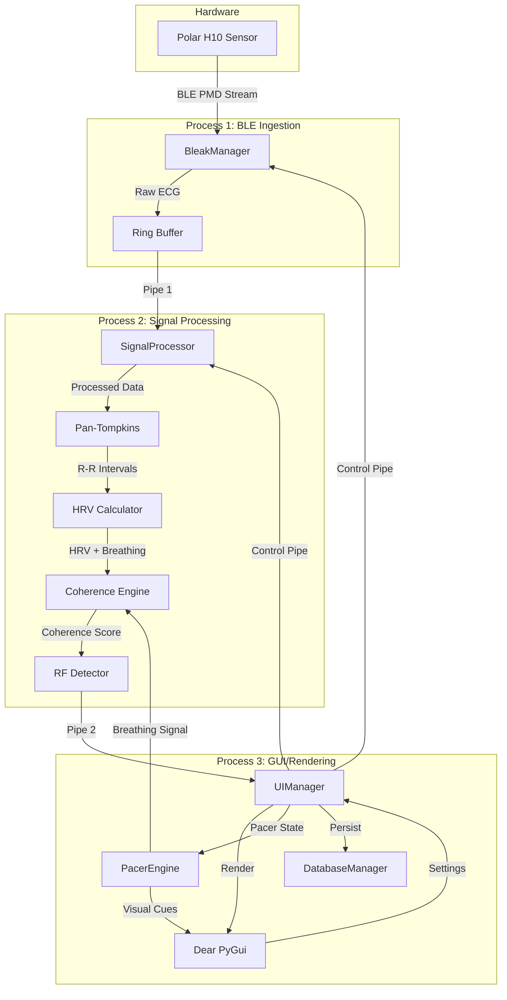
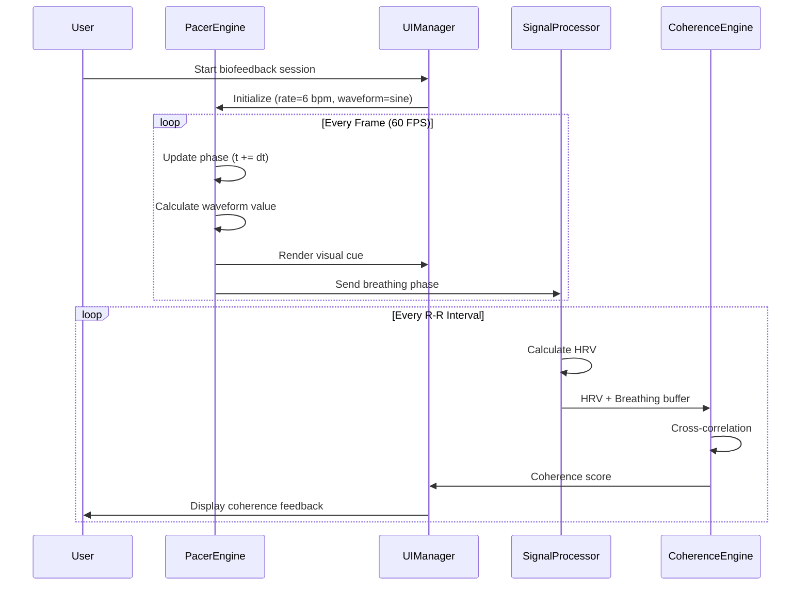

# Polar H10 Real-Time HRV & Resonance Frequency Biofeedback System - Architecture v2.0

**Document Version:** 2.0  
**Last Updated:** 2026-02-14T11:18:00Z  
**Status:** Design Specification for Enhanced Features

---

## Table of Contents

1. [Executive Summary](#executive-summary)
2. [Gap Analysis](#gap-analysis)
3. [Enhanced System Overview](#enhanced-system-overview)
4. [Pacer Engine Architecture](#pacer-engine-architecture)
5. [Coherence Calculation System](#coherence-calculation-system)
6. [Resonance Frequency Detection](#resonance-frequency-detection)
7. [Full-Screen GUI Design](#full-screen-gui-design)
8. [Enhanced Database Schema](#enhanced-database-schema)
9. [Updated IPC Protocol](#updated-ipc-protocol)
10. [Enhanced Class Structure](#enhanced-class-structure)
11. [Implementation Roadmap](#implementation-roadmap)

---

## 1. Executive Summary

This document extends the existing Polar H10 HRV monitoring system (v1.0) with biofeedback capabilities. The enhanced system adds:

1. **Visual Breathing Pacer** - Configurable waveforms (sine/triangle) with adjustable breathing rates
2. **Real-Time Coherence Metrics** - Cross-correlation between HRV and breathing patterns
3. **Resonance Frequency Detection** - Automated identification of optimal breathing rate
4. **Full-Screen Biofeedback Interface** - Immersive visualization for training sessions

**Key Design Principles (Maintained):**
- Three-process architecture (BLE, Math, GUI)
- <150ms end-to-end latency
- Zero-copy data transfer via shared memory
- Lock-free IPC where possible

**New Design Principles:**
- Pacer runs independently in GUI process at 60 FPS
- Coherence calculated in Math process to avoid GUI blocking
- Resonance frequency detection uses sliding window analysis
- Full-screen mode optimized for minimal distractions

---

## 2. Gap Analysis

### 2.1 Current System Capabilities

| Feature | Status | Notes |
|---------|--------|-------|
| BLE Connection to Polar H10 | ✅ Implemented | Robust with auto-reconnect |
| Real-time ECG Processing | ✅ Implemented | Pan-Tompkins algorithm |
| HRV Metrics (RMSSD, SDNN) | ✅ Implemented | Numba-optimized |
| Multi-process Architecture | ✅ Implemented | 3 processes with IPC |
| User Management | ✅ Implemented | SQLite-based |
| Session Recording | ✅ Implemented | Time-series data storage |
| Configuration Presets | ✅ Implemented | Per-user settings |
| Real-time Visualization | ✅ Implemented | ECG + metrics plots |
| Mock Mode | ✅ Implemented | Testing without hardware |

### 2.2 Required New Features

| Feature | Status | Priority | Complexity |
|---------|--------|----------|------------|
| **Breathing Pacer Engine** | ❌ Missing | High | Medium |
| - Sine wave visualization | ❌ Missing | High | Low |
| - Triangle wave visualization | ❌ Missing | High | Low |
| - Configurable breathing rate | ❌ Missing | High | Low |
| - Inhale/Exhale phase ratios | ❌ Missing | Medium | Medium |
| **Coherence Calculation** | ❌ Missing | High | High |
| - HRV-Breathing cross-correlation | ❌ Missing | High | High |
| - Real-time coherence score | ❌ Missing | High | Medium |
| - Coherence history tracking | ❌ Missing | Medium | Low |
| **Resonance Frequency Detection** | ❌ Missing | Medium | High |
| - Sweep breathing rates | ❌ Missing | Medium | Medium |
| - Peak coherence identification | ❌ Missing | Medium | Medium |
| - Automated RF recommendation | ❌ Missing | Low | Low |
| **Full-Screen GUI** | ❌ Missing | High | Low |
| - Immersive biofeedback layout | ❌ Missing | High | Medium |
| - Minimal UI chrome | ❌ Missing | Medium | Low |
| - Keyboard shortcuts | ❌ Missing | Low | Low |
| **Enhanced Database** | ⚠️ Partial | Medium | Low |
| - Pacer settings storage | ❌ Missing | Medium | Low |
| - Coherence data logging | ❌ Missing | Medium | Low |
| - RF assessment results | ❌ Missing | Low | Low |

### 2.3 Architecture Impact Assessment

| Component | Changes Required | Risk Level |
|-----------|------------------|------------|
| **Process 1 (BLE)** | None | Low |
| **Process 2 (Math)** | Add coherence calculation | Medium |
| **Process 3 (GUI)** | Add pacer engine, full-screen mode | Medium |
| **IPC Protocol** | Add pacer state, coherence data | Low |
| **Database Schema** | Add 3 new tables | Low |
| **Shared Memory** | Potentially add pacer sync buffer | Low |

---

## 3. Enhanced System Overview

### 3.1 Updated Architecture Diagram



### 3.2 New Data Flow: Biofeedback Loop



---

## 4. Pacer Engine Architecture

### 4.1 Design Overview

The **PacerEngine** is a standalone component within the GUI process that generates visual breathing cues. It runs at 60 FPS synchronized with the DearPyGUI render loop.

**Key Requirements:**
- Smooth animation at 60 FPS
- Configurable breathing rate (3-10 breaths/minute)
- Multiple waveform types (sine, triangle)
- Adjustable inhale/exhale ratios
- Visual feedback (expanding/contracting circle or bar)
- Audio cues (optional, future enhancement)

### 4.2 Mathematical Model

#### 4.2.1 Breathing Cycle Timing

```python
# Core parameters
breathing_rate = 6.0  # breaths per minute (BPM)
inhale_ratio = 0.4    # 40% of cycle is inhale
exhale_ratio = 0.6    # 60% of cycle is exhale

# Derived values
cycle_duration = 60.0 / breathing_rate  # seconds per breath
inhale_duration = cycle_duration * inhale_ratio
exhale_duration = cycle_duration * exhale_ratio

# Phase calculation (0.0 to 1.0)
phase = (current_time % cycle_duration) / cycle_duration
```

#### 4.2.2 Waveform Functions

**Sine Wave (Smooth, Natural):**
```python
def sine_waveform(phase: float, inhale_ratio: float) -> float:
    """
    Returns value in range [0.0, 1.0]
    0.0 = fully exhaled, 1.0 = fully inhaled
    """
    if phase < inhale_ratio:
        # Inhale: 0 -> 1
        t = phase / inhale_ratio
        return 0.5 * (1.0 - np.cos(np.pi * t))
    else:
        # Exhale: 1 -> 0
        t = (phase - inhale_ratio) / (1.0 - inhale_ratio)
        return 0.5 * (1.0 + np.cos(np.pi * t))
```

**Triangle Wave (Linear, Easier to Follow):**
```python
def triangle_waveform(phase: float, inhale_ratio: float) -> float:
    """
    Returns value in range [0.0, 1.0]
    Linear ramps for inhale and exhale
    """
    if phase < inhale_ratio:
        # Inhale: linear 0 -> 1
        return phase / inhale_ratio
    else:
        # Exhale: linear 1 -> 0
        t = (phase - inhale_ratio) / (1.0 - inhale_ratio)
        return 1.0 - t
```

**Square Wave (Advanced, Breath Holds):**
```python
def square_waveform(phase: float, inhale_ratio: float, 
                    hold_ratio: float = 0.1) -> float:
    """
    Includes breath holds at top and bottom
    """
    inhale_end = inhale_ratio - hold_ratio
    exhale_start = inhale_ratio + hold_ratio
    
    if phase < inhale_end:
        # Inhale
        return phase / inhale_end
    elif phase < inhale_ratio:
        # Hold at top
        return 1.0
    elif phase < exhale_start:
        # Hold at top (continued)
        return 1.0
    else:
        # Exhale
        t = (phase - exhale_start) / (1.0 - exhale_start)
        return 1.0 - t
```

### 4.3 Visual Representations

#### 4.3.1 Expanding Circle (Primary)

```python
class CirclePacer:
    """
    Circular breathing pacer that expands/contracts.
    """
    def __init__(self, center_x: float, center_y: float, 
                 min_radius: float, max_radius: float):
        self.center = (center_x, center_y)
        self.min_radius = min_radius
        self.max_radius = max_radius
        
    def render(self, phase_value: float):
        """
        phase_value: 0.0 (exhaled) to 1.0 (inhaled)
        """
        radius = self.min_radius + (self.max_radius - self.min_radius) * phase_value
        
        # Color gradient: Blue (exhale) -> Green (inhale)
        color_r = int(0 + 100 * phase_value)
        color_g = int(150 + 105 * phase_value)
        color_b = int(255 - 155 * phase_value)
        
        dpg.draw_circle(
            center=self.center,
            radius=radius,
            color=(color_r, color_g, color_b, 255),
            fill=(color_r, color_g, color_b, 128)
        )
```

#### 4.3.2 Vertical Bar (Alternative)

```python
class BarPacer:
    """
    Vertical bar that rises/falls with breathing.
    """
    def __init__(self, x: float, y_bottom: float, y_top: float, width: float):
        self.x = x
        self.y_bottom = y_bottom
        self.y_top = y_top
        self.width = width
        
    def render(self, phase_value: float):
        """
        phase_value: 0.0 (bottom) to 1.0 (top)
        """
        height = (self.y_top - self.y_bottom) * phase_value
        current_y = self.y_bottom + height
        
        dpg.draw_rectangle(
            pmin=(self.x - self.width/2, self.y_bottom),
            pmax=(self.x + self.width/2, current_y),
            color=(100, 200, 255, 255),
            fill=(100, 200, 255, 180)
        )
```

### 4.4 PacerEngine Class Definition

```python
from dataclasses import dataclass
from enum import Enum
import time
import numpy as np

class WaveformType(Enum):
    SINE = "sine"
    TRIANGLE = "triangle"
    SQUARE = "square"

@dataclass
class PacerConfig:
    """Configuration for breathing pacer."""
    breathing_rate: float = 6.0      # breaths per minute
    inhale_ratio: float = 0.4        # fraction of cycle for inhale
    waveform_type: WaveformType = WaveformType.SINE
    visual_style: str = "circle"     # "circle" or "bar"
    enable_audio: bool = False       # future feature
    
class PacerEngine:
    """
    Generates visual breathing cues synchronized with render loop.
    Runs in GUI process at 60 FPS.
    """
    
    def __init__(self, config: PacerConfig):
        self.config = config
        self.start_time = None
        self.is_running = False
        self.current_phase = 0.0
        self.current_value = 0.0
        
        # Breathing signal buffer for coherence calculation
        # Store last 60 seconds at 60 Hz = 3600 samples
        self.breathing_buffer = deque(maxlen=3600)
        self.breathing_timestamps = deque(maxlen=3600)
        
        # Visual components
        self.circle_pacer = None
        self.bar_pacer = None
        
    def start(self):
        """Begin pacer animation."""
        self.start_time = time.time()
        self.is_running = True
        
    def stop(self):
        """Pause pacer animation."""
        self.is_running = False
        
    def reset(self):
        """Reset to beginning of cycle."""
        self.start_time = time.time()
        self.current_phase = 0.0
        
    def update_config(self, config: PacerConfig):
        """Change pacer parameters on the fly."""
        self.config = config
        
    def update(self, current_time: float) -> float:
        """
        Update pacer state. Called every frame.
        
        Returns:
            float: Current breathing value (0.0 to 1.0)
        """
        if not self.is_running or self.start_time is None:
            return self.current_value
            
        # Calculate elapsed time
        elapsed = current_time - self.start_time
        
        # Calculate cycle parameters
        cycle_duration = 60.0 / self.config.breathing_rate
        
        # Calculate phase (0.0 to 1.0)
        self.current_phase = (elapsed % cycle_duration) / cycle_duration
        
        # Calculate waveform value
        if self.config.waveform_type == WaveformType.SINE:
            self.current_value = self._sine_waveform(
                self.current_phase, 
                self.config.inhale_ratio
            )
        elif self.config.waveform_type == WaveformType.TRIANGLE:
            self.current_value = self._triangle_waveform(
                self.current_phase, 
                self.config.inhale_ratio
            )
        else:  # SQUARE
            self.current_value = self._square_waveform(
                self.current_phase, 
                self.config.inhale_ratio
            )
            
        # Store in buffer for coherence calculation
        self.breathing_buffer.append(self.current_value)
        self.breathing_timestamps.append(current_time)
        
        return self.current_value
        
    def _sine_waveform(self, phase: float, inhale_ratio: float) -> float:
        """Smooth sinusoidal breathing pattern."""
        if phase < inhale_ratio:
            t = phase / inhale_ratio
            return 0.5 * (1.0 - np.cos(np.pi * t))
        else:
            t = (phase - inhale_ratio) / (1.0 - inhale_ratio)
            return 0.5 * (1.0 + np.cos(np.pi * t))
            
    def _triangle_waveform(self, phase: float, inhale_ratio: float) -> float:
        """Linear ramp breathing pattern."""
        if phase < inhale_ratio:
            return phase / inhale_ratio
        else:
            t = (phase - inhale_ratio) / (1.0 - inhale_ratio)
            return 1.0 - t
            
    def _square_waveform(self, phase: float, inhale_ratio: float) -> float:
        """Square wave with breath holds."""
        hold_ratio = 0.1
        inhale_end = inhale_ratio - hold_ratio
        
        if phase < inhale_end:
            return phase / inhale_end
        elif phase < inhale_ratio + hold_ratio:
            return 1.0
        else:
            t = (phase - inhale_ratio - hold_ratio) / (1.0 - inhale_ratio - hold_ratio)
            return 1.0 - t
            
    def render(self, draw_list):
        """
        Render visual pacer to DearPyGUI draw list.
        
        Args:
            draw_list: DearPyGUI drawing context
        """
        if self.config.visual_style == "circle":
            self._render_circle(draw_list)
        else:
            self._render_bar(draw_list)
            
    def _render_circle(self, draw_list):
        """Render expanding/contracting circle."""
        # Get viewport dimensions
        viewport_width = dpg.get_viewport_width()
        viewport_height = dpg.get_viewport_height()
        
        center_x = viewport_width / 2
        center_y = viewport_height / 2
        
        min_radius = 50
        max_radius = 200
        
        radius = min_radius + (max_radius - min_radius) * self.current_value
        
        # Color gradient
        color_r = int(0 + 100 * self.current_value)
        color_g = int(150 + 105 * self.current_value)
        color_b = int(255 - 155 * self.current_value)
        
        dpg.draw_circle(
            center=(center_x, center_y),
            radius=radius,
            color=(color_r, color_g, color_b, 255),
            fill=(color_r, color_g, color_b, 128),
            parent=draw_list
        )
        
        # Add text instruction
        if self.current_phase < self.config.inhale_ratio:
            text = "INHALE"
            text_color = (100, 255, 100, 255)
        else:
            text = "EXHALE"
            text_color = (100, 150, 255, 255)
            
        dpg.draw_text(
            pos=(center_x - 40, center_y - 10),
            text=text,
            color=text_color,
            size=24,
            parent=draw_list
        )
        
    def _render_bar(self, draw_list):
        """Render vertical bar pacer."""
        viewport_width = dpg.get_viewport_width()
        viewport_height = dpg.get_viewport_height()
        
        bar_width = 60
        bar_x = viewport_width / 2
        bar_y_bottom = viewport_height * 0.8
        bar_y_top = viewport_height * 0.2
        
        height = (bar_y_top - bar_y_bottom) * self.current_value
        current_y = bar_y_bottom + height
        
        dpg.draw_rectangle(
            pmin=(bar_x - bar_width/2, bar_y_bottom),
            pmax=(bar_x + bar_width/2, current_y),
            color=(100, 200, 255, 255),
            fill=(100, 200, 255, 180),
            parent=draw_list
        )
        
    def get_breathing_signal(self, duration: float = 60.0) -> Tuple[np.ndarray, np.ndarray]:
        """
        Get recent breathing signal for coherence calculation.
        
        Args:
            duration: Seconds of history to return
            
        Returns:
            Tuple of (timestamps, values) arrays
        """
        if len(self.breathing_buffer) == 0:
            return np.array([]), np.array([])
            
        # Get samples from last 'duration' seconds
        current_time = time.time()
        cutoff_time = current_time - duration
        
        timestamps = np.array(self.breathing_timestamps)
        values = np.array(self.breathing_buffer)
        
        mask = timestamps >= cutoff_time
        
        return timestamps[mask], values[mask]
```

---

## 5. Coherence Calculation System

### 5.1 Theoretical Background

**Coherence** measures the synchronization between two oscillating signals. In HRV biofeedback, we calculate coherence between:
1. **HRV Signal**: Instantaneous heart rate variability (derived from R-R intervals)
2. **Breathing Signal**: The pacer waveform or actual breathing rate

High coherence indicates the heart rate is synchronized with breathing (respiratory sinus arrhythmia), which is associated with improved autonomic balance.

### 5.2 Coherence Metrics

#### 5.2.1 Cross-Correlation Method

```python
def calculate_coherence_crosscorr(hrv_signal: np.ndarray, 
                                   breathing_signal: np.ndarray,
                                   sample_rate: float = 1.0) -> float:
    """
    Calculate coherence using normalized cross-correlation.
    
    Args:
        hrv_signal: Instantaneous heart rate or HRV metric over time
        breathing_signal: Breathing waveform values over time
        sample_rate: Sampling rate of signals (Hz)
        
    Returns:
        float: Coherence score (0.0 to 1.0)
    """
    # Ensure equal length
    min_len = min(len(hrv_signal), len(breathing_signal))
    hrv = hrv_signal[-min_len:]
    breath = breathing_signal[-min_len:]
    
    # Normalize signals (zero mean, unit variance)
    hrv_norm = (hrv - np.mean(hrv)) / (np.std(hrv) + 1e-8)
    breath_norm = (breath - np.mean(breath)) / (np.std(breath) + 1e-8)
    
    # Cross-correlation at zero lag
    correlation = np.correlate(hrv_norm, breath_norm, mode='valid')[0] / min_len
    
    # Convert to 0-1 range (correlation is -1 to 1)
    coherence = (correlation + 1.0) / 2.0
    
    return coherence
```

#### 5.2.2 Spectral Coherence Method (Advanced)

```python
from scipy.signal import coherence as scipy_coherence

def calculate_coherence_spectral(hrv_signal: np.ndarray,
                                  breathing_signal: np.ndarray,
                                  sample_rate: float = 1.0,
                                  breathing_freq: float = 0.1) -> float:
    """
    Calculate coherence using spectral analysis.
    
    Args:
        hrv_signal: HRV time series
        breathing_signal: Breathing time series
        sample_rate: Sampling rate (Hz)
        breathing_freq: Expected breathing frequency (Hz)
        
    Returns:
        float: Coherence at breathing frequency
    """
    # Ensure equal length and sufficient data
    min_len = min(len(hrv_signal), len(breathing_signal))
    if min_len < 256:  # Need enough samples for FFT
        return 0.0
        
    hrv = hrv_signal[-min_len:]
    breath = breathing_signal[-min_len:]
    
    # Calculate coherence spectrum
    freqs, Cxy = scipy_coherence(hrv, breath, fs=sample_rate, nperseg=256)
    
    # Find coherence at breathing frequency
    freq_idx = np.argmin(np.abs(freqs - breathing_freq))
    coherence_value = Cxy[freq_idx]
    
    return coherence_value
```

### 5.3 CoherenceEngine Class

```python
from scipy.signal import resample
from collections import deque

class CoherenceEngine:
    """
    Calculates real-time coherence between HRV and breathing.
    Runs in Signal Processing process (Process 2).
    """
    
    def __init__(self, window_size: int = 60):
        """
        Args:
            window_size: Seconds of data to use for coherence calculation
        """
        self.window_size = window_size
        
        # HRV signal buffer (interpolated to 1 Hz)
        self.hrv_buffer = deque(maxlen=window_size)
        self.hrv_timestamps = deque(maxlen=window_size)
        
        # Breathing signal buffer (from pacer, at 60 Hz, resampled to 1 Hz)
        self.breathing_buffer = deque(maxlen=window_size)
        self.breathing_timestamps = deque(maxlen=window_size)
        
        # Coherence history
        self.coherence_history = deque(maxlen=600)  # 10 minutes at 1 Hz
        self.coherence_timestamps = deque(maxlen=600)
        
    def update_hrv(self, timestamp: float, heart_rate: float):
        """
        Add new HRV data point.
        
        Args:
            timestamp: Unix timestamp
            heart_rate: Instantaneous heart rate (BPM)
        """
        self.hrv_buffer.append(heart_rate)
        self.hrv_timestamps.append(timestamp)
        
    def update_breathing(self, timestamps: np.ndarray, values: np.ndarray):
        """
        Add breathing signal data from pacer.
        
        Args:
            timestamps: Array of timestamps
            values: Array of breathing values (0.0 to 1.0)
        """
        # Resample to 1 Hz for coherence calculation
        if len(timestamps) < 2:
            return
            
        # Create 1 Hz time grid
        start_time = timestamps[0]
        end_time = timestamps[-1]
        duration = end_time - start_time
        
        if duration < 1.0:
            return
            
        num_samples = int(duration) + 1
        time_grid = np.linspace(start_time, end_time, num_samples)
        
        # Interpolate breathing signal to 1 Hz
        resampled_values = np.interp(time_grid, timestamps, values)
        
        # Add to buffer
        for t, v in zip(time_grid, resampled_values):
            self.breathing_buffer.append(v)
            self.breathing_timestamps.append(t)
            
    def calculate_coherence(self) -> Optional[float]:
        """
        Calculate current coherence score.
        
        Returns:
            float: Coherence score (0.0 to 1.0) or None if insufficient data
        """
        # Need at least 30 seconds of data
        if len(self.hrv_buffer) < 30 or len(self.breathing_buffer) < 30:
            return None
            
        # Convert to arrays
        hrv_signal = np.array(self.hrv_buffer)
        breathing_signal = np.array(self.breathing_buffer)
        
        # Align signals by timestamp
        hrv_times = np.array(self.hrv_timestamps)
        breath_times = np.array(self.breathing_timestamps)
        
        # Find common time range
        start_time = max(hrv_times[0], breath_times[0])
        end_time = min(hrv_times[-1], breath_times[-1])
        
        if end_time - start_time < 30:
            return None
            
        # Create common time grid (1 Hz)
        common_times = np.arange(start_time, end_time, 1.0)
        
        # Interpolate both signals to common grid
        hrv_aligned = np.interp(common_times, hrv_times, hrv_signal)
        breath_aligned = np.interp(common_times, breath_times, breathing_signal)
        
        # Calculate coherence using cross-correlation
        coherence = self._calculate_crosscorr(hrv_aligned, breath_aligned)
        
        # Store in history
        current_time = time.time()
        self.coherence_history.append(coherence)
        self.coherence_timestamps.append(current_time)
        
        return coherence
        
    def _calculate_crosscorr(self, signal1: np.ndarray, signal2: np.ndarray) -> float:
        """Normalized cross-correlation at zero lag."""
        # Normalize
        s1 = (signal1 - np.mean(signal1)) / (np.std(signal1) + 1e-8)
        s2 = (signal2 - np.mean(signal2)) / (np.std(signal2) + 1e-8)
        
        # Cross-correlation
        corr = np.correlate(s1, s2, mode='valid')[0] / len(s1)
        
        # Map to 0-1 range
        coherence = (corr + 1.0) / 2.0
        
        return np.clip(coherence, 0.0, 1.0)
        
    def get_coherence_history(self, duration: float = 300.0) -> Tuple[np.ndarray, np.ndarray]:
        """
        Get recent coherence history.
